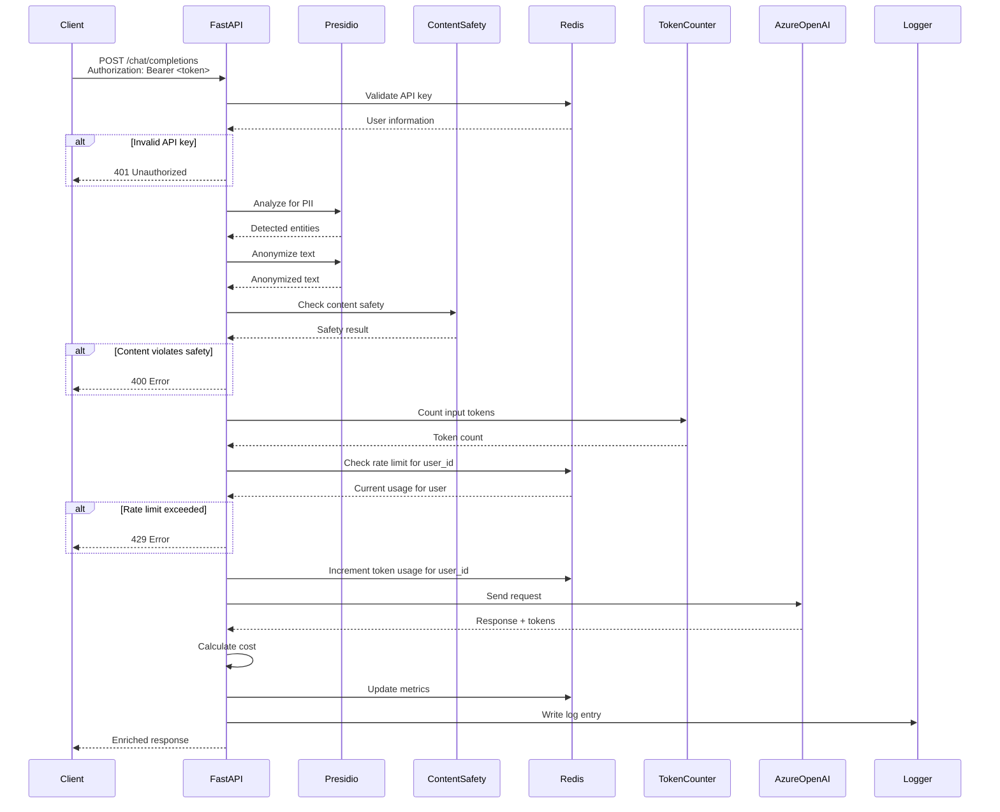

# Nexus AI Gateway - Architecture Diagram

This document provides a detailed architecture diagram of the Nexus AI Gateway system, showcasing all components, data flows, and integrations.

## System Architecture

```mermaid
graph TB
    subgraph "Client Applications"
        Client[Client App]
        PyRIT[PyRIT Testing Framework]
    end

    subgraph "Nexus AI Gateway"
        FastAPI[FastAPI Server<br/>/chat/completions]
        
        subgraph "Authentication"
            AuthVerifier[API Key Verifier<br/>Bearer Token Validation]
        end
        
        subgraph "Security Pipeline"
            PresidioAnalyzer[Presidio Analyzer<br/>PII Detection]
            PresidioAnonymizer[Presidio Anonymizer<br/>Data Redaction]
            ContentSafety[Azure Content Safety<br/>Harmful Content Filter]
        end
        
        subgraph "Control & Monitoring"
            RateLimiter[Rate Limiter<br/>Token-based Limits<br/>Per-User]
            TokenCounter[tiktoken<br/>Token Counting]
            CostCalculator[Cost Calculator<br/>USD Estimation]
            Logger[Request Logger<br/>File Logging]
        end
    end

    subgraph "External Services"
        AzureOpenAI[Azure OpenAI<br/>GPT-4o-mini]
        AzureContentSafety[Azure Content Safety API]
    end

    subgraph "Data Storage"
        Redis[(Redis<br/>Users & API Keys<br/>Rate Limits & Metrics)]
        LogFile[(api.log<br/>Request Logs)]
    end

    subgraph "Monitoring"
        MetricsAPI[/metrics Endpoint]
        AdminAPI[/admin/users<br/>User Management]
    end

    Client --> FastAPI
    PyRIT --> FastAPI
    
    FastAPI --> AuthVerifier
    AuthVerifier --> Redis
    AuthVerifier --> PresidioAnalyzer
    PresidioAnalyzer --> PresidioAnonymizer
    PresidioAnonymizer --> ContentSafety
    ContentSafety --> AzureContentSafety
    
    ContentSafety --> RateLimiter
    RateLimiter --> Redis
    RateLimiter --> TokenCounter
    
    TokenCounter --> AzureOpenAI
    AzureOpenAI --> CostCalculator
    
    CostCalculator --> Logger
    Logger --> LogFile
    CostCalculator --> Redis
    
    Redis --> MetricsAPI
    
    FastAPI --> MetricsAPI

    style FastAPI fill:#4A90E2
    style PresidioAnalyzer fill:#E8F4F8
    style PresidioAnonymizer fill:#E8F4F8
    style ContentSafety fill:#E8F4F8
    style AzureOpenAI fill:#FF6B6B
    style AzureContentSafety fill:#FF6B6B
    style Redis fill:#FFD93D
    style LogFile fill:#FFD93D
    style MetricsAPI fill:#6BCF7F
```

## Request Flow

### 1. Request Reception
- Client sends POST request to `/chat/completions` endpoint
- FastAPI validates request structure (messages, model, parameters)

### 2. Authentication
- API key extracted from `Authorization: Bearer <token>` header
- Redis queried to validate API key and retrieve user information
- User ID identified from authenticated session
- Request rejected with 401 if invalid or missing API key

### 3. Security Pipeline
- **PII Analysis**: Presidio Analyzer scans each message for sensitive entities
- **PII Anonymization**: Detected entities replaced with safe placeholders
- **Content Safety**: Anonymized text sent to Azure Content Safety API
  - Checks for: Hate, Self-Harm, Sexual, Violence
  - Blocks if severity ≥ 4

### 4. Rate Limiting
- Token count calculated using tiktoken
- Redis checked for current authenticated user's token usage
- User-specific rate limit key: `user:{user_id}:tokens`
- Request blocked if limit exceeded (1000 tokens/hour per user)

### 5. LLM Processing
- Clean, anonymized request sent to Azure OpenAI
- Response received with completion tokens

### 6. Post-Processing
- Output tokens counted
- Cost calculated (input + output tokens × rates)
- Metrics updated in Redis:
  - Total requests
  - Total tokens
  - Total cost
  - PII detections by type
  - Content safety violations
  - Azure blocks

### 7. Logging
- Structured log entry written to `api.log`:
  - Timestamps (local + Azure)
  - Model used
  - Token counts
  - Cost
  - Duration

### 8. Response
- Enriched response returned to client:
  - Anonymized prompt sent
  - PII detection info
  - Azure response
  - Token estimates
  - Cost breakdown
  - Rate limit status

## Component Details

### FastAPI Server
- **Technology**: FastAPI framework
- **Endpoints**: 
  - `POST /chat/completions` - Main chat endpoint (requires authentication)
  - `GET /metrics` - Metrics retrieval (public)
  - `GET /` - Health check (public)
  - `POST /admin/users` - Create user (requires authentication)
  - `GET /admin/users` - List users (requires authentication)
  - `DELETE /admin/users/{user_id}` - Revoke user (requires authentication)
- **Features**: Async request handling, request validation, Bearer token authentication

### Presidio Analyzer
- **Technology**: Microsoft Presidio Analyzer Engine
- **Entities Detected**: PERSON, PHONE_NUMBER, EMAIL_ADDRESS, US_SSN, CREDIT_CARD, LOCATION
- **Language**: English
- **Output**: List of detected entities with confidence scores

### Presidio Anonymizer
- **Technology**: Microsoft Presidio Anonymizer Engine
- **Strategy**: Replace with generic placeholders
- **Custom Operators**: 
  - PERSON → "REDACTED-NAME"
  - PHONE_NUMBER → "REDACTED-PHONE_NUMBER"
  - EMAIL_ADDRESS → "REDACTED-EMAIL"
  - US_SSN → "REDACTED-SSN"
  - CREDIT_CARD → "REDACTED-CREDIT_CARD"
  - LOCATION → "REDACTED-LOCATION"

### Azure Content Safety
- **Service**: Azure AI Content Safety API
- **Categories**: Hate, Self-Harm, Sexual, Violence
- **Threshold**: Severity level 4 (blocks request)
- **Integration**: REST API call with Azure credentials

### API Key Authentication
- **Storage**: Redis
- **Key Mappings**: 
  - `api_key:{api_key}` → `user_id` (lookup mapping)
  - `user:{user_id}` → User hash (user_id, name, api_key, created_at)
  - `users:all` → Set of all user IDs
- **Validation**: Bearer token extracted from Authorization header, looked up in Redis
- **Security**: API keys generated using `secrets.token_urlsafe(32)` for cryptographic security

### Rate Limiter
- **Storage**: Redis
- **Key Format**: `user:{user_id}:tokens` (based on authenticated user ID)
- **Limit**: 1000 tokens per hour per user
- **TTL**: 3600 seconds (1 hour)
- **Behavior**: Increments on success, blocks if limit exceeded
- **Per-User**: Each authenticated user has independent rate limit tracking

### Token Counter
- **Library**: tiktoken
- **Model**: Uses encoding for specified model (e.g., gpt-4o-mini)
- **Calculation**: 
  - Content tokens
  - Role tokens
  - Formatting overhead (4 per message + 3 base)

### Cost Calculator
- **Input Rate**: $0.00015 per 1K tokens
- **Output Rate**: $0.0006 per 1K tokens
- **Calculation**: (input_tokens / 1000 × input_rate) + (output_tokens / 1000 × output_rate)
- **Precision**: Micro-USD stored in Redis (multiplied by 100000)

### Request Logger
- **Format**: JSON structured logs
- **Location**: `api.log` file
- **Fields**: 
  - local_timestamp
  - azure_timestamp
  - model
  - tokens
  - cost
  - duration_seconds

### Redis Storage
- **Purpose**: User management, authentication, rate limiting, and metrics
- **User Management Keys**:
  - `api_key:{api_key}` → `user_id` - API key to user ID lookup
  - `user:{user_id}` - Hash containing user_id, name, api_key, created_at
  - `users:all` - Set of all user IDs for listing
- **Rate Limiting Keys**:
  - `user:{user_id}:tokens` - Per-user token counter (with TTL)
- **Metrics Keys**:
  - `metrics:total_requests` - Total request count
  - `metrics:total_tokens` - Total token count
  - `metrics:total_cost_micro_usd` - Total cost in micro-USD
  - `metrics:azure_blocked_requests` - Azure block count
  - `metrics:pii:{entity_type}` - PII detection counts
  - `metrics:content_safety:{category}` - Content safety violation counts

### Metrics API
- **Endpoint**: `GET /metrics` (public, no authentication required)
- **Response Structure**:
  - Overview: total_requests, total_tokens, total_cost_usd, azure_blocked_requests
  - PII detections: counts by entity type
  - Content safety violations: counts by category

### Admin API
- **Endpoints**:
  - `POST /admin/users` - Create new user (requires authentication)
  - `GET /admin/users` - List all users with details (requires authentication)
  - `DELETE /admin/users/{user_id}` - Revoke user and invalidate API key (requires authentication)
- **Response**: User objects with user_id, name, api_key, created_at
- **Authentication**: All admin endpoints require valid Bearer token

## Data Flow Diagram



## Integration Points

### PyRIT Integration
- Custom `NexusGatewayTarget` class extends PyRIT's `PromptChatTarget`
- Enables automated prompt injection testing
- Sends test prompts through gateway and captures responses
- Useful for security validation and compliance testing

### Azure OpenAI
- **Endpoint**: Azure OpenAI deployment URL
- **Model**: gpt-4o-mini (configurable)
- **API Version**: 2025-01-01-preview
- **Authentication**: API key
- **Error Handling**: Catches BadRequestError for policy violations

### Azure Content Safety
- **Endpoint**: Azure Content Safety cognitive service
- **Authentication**: Azure Key Credential
- **Request**: AnalyzeTextOptions with anonymized text
- **Response**: CategoriesAnalysis with severity scores

## Error Handling

1. **Invalid/Missing API Key**: HTTP 401 with "Invalid or missing API key" message
2. **Redis Connection Error**: Returns error message, doesn't crash
3. **Content Safety Violation**: HTTP 400 with policy violation message
4. **Rate Limit Exceeded**: HTTP 429 with usage details and reset time (per-user)
5. **Azure OpenAI Block**: HTTP 400 with block message, metrics incremented
6. **PII Detection**: Logged but doesn't block (anonymization applied)
7. **User Not Found** (revoke): HTTP 404 when attempting to revoke non-existent user

## Performance Considerations

- **Async Operations**: FastAPI async/await for non-blocking I/O
- **Redis Caching**: Fast in-memory storage for rate limits and metrics
- **Parallel Safety Checks**: PII and content safety can be optimized for parallel execution
- **Token Counting**: Efficient tiktoken encoding (local, no API calls)
- **Logging**: File I/O is synchronous but non-blocking for response

## Scalability

- **Horizontal Scaling**: Stateless design allows multiple instances
- **Redis Shared State**: Multiple gateway instances share user data, rate limits, and metrics
- **Connection Pooling**: Redis connection can be pooled for high concurrency
- **Async Azure Calls**: Non-blocking external API calls
- **Per-User Isolation**: Each user's rate limits and data are independently tracked
- **User Management**: Redis-based user store enables fast lookups and scales horizontally

