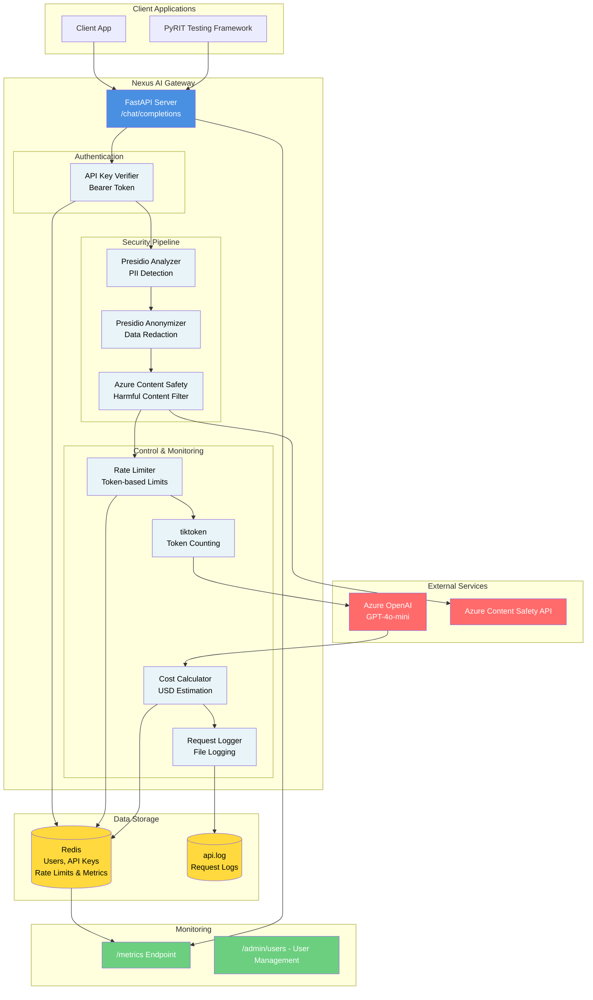

# Nexus AI Gateway

A production-ready FastAPI gateway that sits between your applications and Azure OpenAI, adding essential security, compliance, and observability layers. Think of it as your intelligent middleware that ensures every AI request is safe, compliant, and properly monitored before it reaches the LLM.

## Why This Exists

When you're building applications that use Azure OpenAI, you quickly realize that the base API doesn't give you everything you need out of the box. You need to protect user data, filter harmful content, control costs, and understand what's happening in your system. Building these features into every application is repetitive and error-prone.

This gateway centralizes all of that logic. Instead of each service handling PII detection, content moderation, rate limiting, and cost tracking separately, they all route through Nexus. It's one place to configure policies, monitor usage, and ensure compliance across your entire AI infrastructure.

## What It Does

Nexus intercepts chat completion requests, runs them through a series of security and compliance checks, and only forwards clean, safe requests to Azure OpenAI. Every request gets logged, costed, and tracked. If something looks suspicious or violates policies, the request gets blocked before it ever reaches the model.

## Features

### 🔑 API Key Authentication

**What it does:** Secures all API endpoints with Bearer token authentication. Users are required to include a valid API key in the `Authorization` header for all requests.

**Why it matters:** Prevents unauthorized access to your gateway and ensures that API usage is tracked per user. Each user gets a unique API key that can be independently managed, revoked, and rate-limited.

**Features:**
- Bearer token authentication via `Authorization` header
- API keys stored securely in Redis
- User management endpoints to create, list, and revoke users
- Per-user rate limiting based on authenticated user ID
- Each user has: `user_id`, `name`, `api_key`, and `created_at` timestamp

### 🔒 PII Detection & Anonymization

**What it does:** Automatically scans incoming messages for personally identifiable information and replaces it with safe placeholders before sending to the LLM.

**Why it matters:** You probably don't want to send customer names, phone numbers, or credit card details to an external AI service. Even if you trust Azure OpenAI, there are compliance requirements (GDPR, HIPAA, etc.) that make this a necessity. Plus, it's just good practice - why expose sensitive data when you don't have to?

The gateway detects:
- Names (PERSON)
- Phone numbers
- Email addresses
- Social Security Numbers (US_SSN)
- Credit card numbers
- Physical locations

When detected, these get replaced with generic tags like `REDACTED-NAME` or `REDACTED-PHONE_NUMBER`. The original content never leaves your infrastructure in its raw form.

### 🛡️ Content Safety Filtering

**What it does:** Analyzes messages for harmful content across four categories: hate speech, self-harm, sexual content, and violence. Requests that exceed severity thresholds are rejected.

**Why it matters:** Even with PII removed, you don't want your AI generating responses to prompts that are harmful, illegal, or violate your organization's policies. This acts as a first line of defense. It's also useful for preventing abuse - if someone is trying to use your API to generate inappropriate content, you can catch it early.

The system uses Azure AI Content Safety, which is specifically designed for this purpose. It's more sophisticated than simple keyword filtering and understands context.

### ⏱️ Rate Limiting

**What it does:** Tracks token usage per user and enforces limits within a time window (currently 1 hour). Prevents any single user from consuming too many resources.

**Why it matters:** Without rate limiting, a single user or a buggy integration could blow through your entire API budget in minutes. It also helps ensure fair usage across your user base. The current implementation uses a token-based limit (1000 tokens per hour per user), which is more accurate than simple request counting since different requests can vary wildly in size.

The limits are stored in Redis with automatic expiration, so they reset cleanly without manual intervention.

### 💰 Cost Estimation & Tracking

**What it does:** Calculates the cost of each request based on input/output token counts and current pricing, then tracks cumulative costs across all requests.

**Why it matters:** AI API costs can add up quickly, especially at scale. You need visibility into what you're spending and where. This feature gives you per-request cost estimates and aggregate metrics so you can:
- Set budgets and alerts
- Understand which use cases are most expensive
- Optimize prompts to reduce costs
- Bill back to different departments or customers

The cost calculation happens in real-time using current token counts and configured pricing rates.

### 📊 Comprehensive Metrics

**What it does:** Collects detailed metrics about API usage, including total requests, tokens, costs, PII detections by type, content safety violations, and Azure OpenAI blocks.

**Why it matters:** You can't improve what you don't measure. These metrics help you:
- Identify trends (are PII detections increasing? Are costs spiking?)
- Debug issues (why are requests being blocked?)
- Plan capacity (how much are we actually using?)
- Demonstrate compliance (show auditors that you're detecting and handling PII)

All metrics are stored in Redis for fast access and can be queried via the `/metrics` endpoint.

### 📝 Request Logging

**What it does:** Logs every request with timestamps, token counts, costs, and duration to a local log file.

**Why it matters:** When something goes wrong, you need to be able to trace back what happened. The logs include both local timestamps (when Nexus received the request) and Azure timestamps (when the model processed it), which helps with debugging timing issues or delays.

The logs are structured JSON, making them easy to parse and analyze with log aggregation tools.

### 🔌 PyRIT Integration

**What it does:** Includes a custom PyRIT target adapter that allows you to test the gateway for prompt injection vulnerabilities.

**Why it matters:** Security testing is critical, especially for AI systems. PyRIT (Prompt Risk Identification Toolkit) is Microsoft's framework for testing AI systems. The integration makes it easy to run automated tests against your gateway to ensure it's properly handling malicious prompts.

## Architecture Overview

The gateway follows a pipeline architecture where each request flows through several stages:

1. **Request Reception** - FastAPI receives the chat completion request
2. **Authentication** - API key validated from Authorization header
3. **PII Analysis** - Presidio Analyzer scans for sensitive data
4. **PII Anonymization** - Presidio Anonymizer replaces detected entities
5. **Content Safety Check** - Azure Content Safety evaluates for harmful content
6. **Rate Limit Check** - Redis verifies token usage limits for authenticated user
7. **Token Counting** - tiktoken calculates input token count
8. **Azure OpenAI Call** - Clean request forwarded to Azure
9. **Cost Calculation** - Response tokens counted and costs calculated
10. **Metrics Update** - Redis updated with usage statistics
11. **Response Return** - Enriched response with metadata returned

All of this happens asynchronously to maintain good performance.

### Architecture Diagram



**Component Descriptions:**

- **FastAPI Server**: Main entry point handling HTTP requests and orchestrating the pipeline
- **API Key Verifier**: Validates Bearer tokens from Authorization header against Redis user store
- **Presidio Analyzer**: Scans messages for PII entities (names, emails, SSNs, etc.)
- **Presidio Anonymizer**: Replaces detected PII with safe placeholders
- **Azure Content Safety**: Evaluates content for hate, self-harm, sexual, and violence categories
- **Rate Limiter**: Enforces per-user token limits using Redis counters (based on authenticated user ID)
- **Token Counter**: Calculates input token counts using tiktoken encoding
- **Cost Calculator**: Computes USD costs based on input/output tokens and pricing rates
- **Request Logger**: Writes structured logs with timestamps, tokens, costs, and duration
- **Redis**: Stores user accounts, API keys, rate limit counters, usage metrics, and PII detection counts
- **Metrics API**: Exposes aggregated statistics via GET endpoint
- **Admin API**: User management endpoints for creating, listing, and revoking users

## Getting Started

### Prerequisites

- Python 3.8+
- Redis server running locally (or update connection details)
- Azure OpenAI account with API key
- Azure Content Safety account with API key

### Installation

1. Install dependencies:
```bash
cd nexus-gateway
pip install -r src/requirements.txt
```

2. **Configure environment variables:**
   
   Create a `.env` file or export environment variables:
   
   **Required variables:**
   ```bash
   export AZURE_CONTENT_SAFETY_ENDPOINT="https://your-content-safety-endpoint.cognitiveservices.azure.com/"
   export AZURE_CONTENT_SAFETY_KEY="your_content_safety_api_key"
   export AZURE_OPENAI_ENDPOINT="https://your-openai-resource.openai.azure.com/"
   export AZURE_OPENAI_API_KEY="your_azure_openai_api_key"
   ```
   
   **Optional variables (with defaults):**
   ```bash
   export AZURE_OPENAI_API_VERSION="2025-01-01-preview"  # Default
   export REDIS_HOST="localhost"                          # Default
   export REDIS_PORT="6379"                               # Default
   export REDIS_PASSWORD=""                               # Optional, if Redis requires auth
   export LOG_FILE="api.log"                              # Default
   export LOG_LEVEL="INFO"                                # Default
   export INPUT_COST_PER_1K="0.00015"                     # Default (USD)
   export OUTPUT_COST_PER_1K="0.0006"                     # Default (USD)
   export RATE_LIMIT_TOKENS="1000"                        # Default
   export RATE_LIMIT_WINDOW_SECONDS="3600"                # Default (1 hour)
   ```
   
   **Using .env file (optional):**
   
   For easier configuration, you can use a `.env` file. Install `python-dotenv`:
   ```bash
   pip install python-dotenv
   ```
   
   Then copy the example file and edit it:
   ```bash
   cp nexus-gateway/env.example .env
   # Edit .env with your actual credentials
   ```
   
   The application will automatically load variables from `.env` if `python-dotenv` is installed.

3. Start Redis (if not already running):
```bash
redis-server
```

4. **Create your first user:**
   ```bash
   cd nexus-gateway/src
   python bootstrap_user.py
   ```
   Save the API key that's displayed - you'll need it for authentication.

   **📖 For detailed authentication setup instructions, see [`nexus-gateway/AUTHENTICATION.md`](nexus-gateway/AUTHENTICATION.md)**

5. Run the gateway:
```bash
cd nexus-gateway/src
uvicorn main:app --reload
```

The API will be available at `http://localhost:8000`

### API Endpoints

**Public Endpoints:**
- `GET /` - Health check endpoint
- `GET /metrics` - Retrieve aggregated metrics (public, no authentication required)

**Authenticated Endpoints:**
- `POST /chat/completions` - Main endpoint for chat completions (requires Bearer token)
  - Requires `Authorization: Bearer <api_key>` header
  - Compatible with OpenAI format

**Admin Endpoints:**
- `POST /admin/users` - Create a new user (requires authentication)
- `GET /admin/users` - List all users (requires authentication)
- `DELETE /admin/users/{user_id}` - Revoke a user (requires authentication)

### Authentication

All protected endpoints require a Bearer token in the `Authorization` header:

```
Authorization: Bearer <your_api_key>
```

### Example Request

```bash
curl -X POST "http://localhost:8000/chat/completions" \
  -H "Authorization: Bearer YOUR_API_KEY_HERE" \
  -H "Content-Type: application/json" \
  -d '{
    "messages": [
      {"role": "user", "content": "My name is John Doe and my email is john@example.com"}
    ],
    "model": "gpt-4o-mini",
    "max_tokens": 1000,
    "temperature": 0.7
  }'
```

### User Management Examples

**Create a new user:**
```bash
curl -X POST "http://localhost:8000/admin/users" \
  -H "Authorization: Bearer YOUR_API_KEY_HERE" \
  -H "Content-Type: application/json" \
  -d '{"name": "New User"}'
```

**List all users:**
```bash
curl -X GET "http://localhost:8000/admin/users" \
  -H "Authorization: Bearer YOUR_API_KEY_HERE"
```

**Revoke a user:**
```bash
curl -X DELETE "http://localhost:8000/admin/users/{user_id}" \
  -H "Authorization: Bearer YOUR_API_KEY_HERE"
```

The response includes:
- The anonymized prompt that was sent to Azure
- PII detection information
- The Azure OpenAI response
- Token counts and cost estimates
- Rate limit status

## Configuration

All configuration is done via environment variables. Key settings:

### Required Environment Variables
- `AZURE_CONTENT_SAFETY_ENDPOINT` - Azure Content Safety service endpoint
- `AZURE_CONTENT_SAFETY_KEY` - Azure Content Safety API key
- `AZURE_OPENAI_ENDPOINT` - Azure OpenAI service endpoint
- `AZURE_OPENAI_API_KEY` - Azure OpenAI API key

### Optional Environment Variables (with defaults)

**Service Configuration:**
- `AZURE_OPENAI_API_VERSION` - Azure OpenAI API version (default: `2025-01-01-preview`)
- `REDIS_HOST` - Redis server host (default: `localhost`)
- `REDIS_PORT` - Redis server port (default: `6379`)
- `REDIS_PASSWORD` - Redis password (optional, if Redis requires authentication)

**Logging:**
- `LOG_FILE` - Log file path (default: `api.log`)
- `LOG_LEVEL` - Logging level (default: `INFO`)

**Rate Limiting:**
- `RATE_LIMIT_TOKENS` - Token limit per window (default: `1000`)
- `RATE_LIMIT_WINDOW_SECONDS` - Rate limit window in seconds (default: `3600` = 1 hour)

**Cost Configuration:**
- `INPUT_COST_PER_1K` - Cost per 1K input tokens in USD (default: `0.00015`)
- `OUTPUT_COST_PER_1K` - Cost per 1K output tokens in USD (default: `0.0006`)

### Other Configurable Settings (in code)

- **PII Entities**: The list of entities to detect can be modified in the code (default: PERSON, PHONE_NUMBER, EMAIL_ADDRESS, US_SSN, CREDIT_CARD, LOCATION)
- **Content Safety Thresholds**: Severity level 4 is the blocking threshold. Lower values are stricter.

## Monitoring

Check the `/metrics` endpoint regularly to monitor:
- Total API usage (requests, tokens, costs)
- PII detection patterns
- Content safety violations
- Azure OpenAI blocks

Logs are written to `api.log` in the same directory as the application.

## Security Considerations

- **Configuration**: All API keys and endpoints are configured via environment variables, not hardcoded. Never commit `.env` files or expose credentials in version control.
- **User API Keys**: User API keys are stored in Redis and validated on every request. Store your initial admin key securely - it cannot be retrieved once created.
- **Authentication**: All protected endpoints require valid Bearer tokens. Invalid or missing tokens return 401 Unauthorized.
- **User Management**: Currently, any authenticated user can manage other users. Consider implementing role-based access control (RBAC) for production.
- **Redis**: Ensure Redis is properly secured. Use `REDIS_PASSWORD` environment variable for authentication and consider using Redis AUTH and TLS in production. User data and API keys are stored in Redis, so access control is critical.
- **Environment Variables**: In production, use a secrets manager (AWS Secrets Manager, Azure Key Vault, HashiCorp Vault) or secure environment variable injection rather than `.env` files.
- **Network**: The gateway should be deployed behind a firewall with proper network segmentation.
- **Logs**: Log files may contain sensitive information. Ensure proper access controls and consider log encryption.
- **Key Rotation**: Regularly review and revoke unused API keys. Create new users and revoke old ones to rotate credentials.

## Future Enhancements

Potential improvements for production use:
- Role-based access control (RBAC) for fine-grained permissions
- API key rotation and expiration policies
- Per-user configurable rate limits
- Configurable policies via API or config file
- Integration with monitoring tools (Prometheus, Datadog, etc.)
- Request queuing for high-load scenarios
- Caching layer for repeated requests
- Webhook support for real-time alerts
- Audit logging for user management operations
- Multi-tenant isolation and resource quotas


